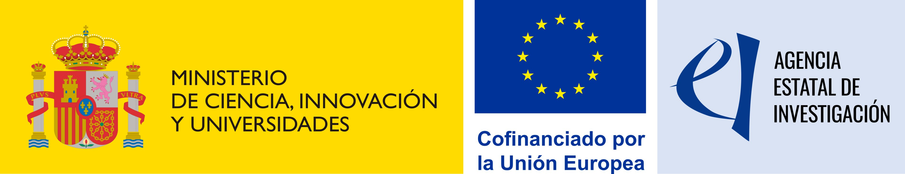

The **Computer Vision and Pattern Discovery (CVPD) group** at the **University of the Basque Country (UPV/EHU)** is offering a **fully funded 4-year PhD position** within the recently awarded project **TOSBI: Towards Scalable and Generalized Solutions in Biomedical Images**, supported by the Spanish State Agency for Research (AEI).  

<!--more-->

---

### 🎯 About the PhD Project  

The doctoral research will focus on the **development of new deep learning methodologies for biomedical image analysis**, aiming to overcome key limitations such as **scarcity of annotated data, computational scalability, and model generalization**.  

The selected PhD student will investigate **partially supervised learning strategies** (self-/semi-supervised, few/zero-shot learning) and the **adaptation of foundation models** to bioimage analysis tasks, including **segmentation, classification, and object detection** of cellular and tissue structures. The work will combine **state-of-the-art AI methods** with validation on real biomedical data, contributing to the creation of **robust and accessible tools for the scientific community** through platforms such as [**BiaPy**](https://biapyx.github.io/).  

---

### 👩‍🎓 Candidate Profile  

- Degree and Master in **Computer Science, Mathematics, Telecommunication Engineering, Physics, Bioinformatics, or related fields**.  
- Skills in **scientific programming** (Python, PyTorch/TensorFlow, computer vision libraries).  
- Good command of **English** (spoken and written).  
- Strong motivation for **interdisciplinary research** at the interface of computer vision, deep learning, and biomedical imaging.  

Additional valued merits include prior experience in AI/bioimage projects, contributions to open-source software, and participation in international collaborations.  

---

### 📅 Timeline  

- **Call opening:** Expected October 10, 2025  
- **Deadline:** 3 weeks after call opening  

---

### 📧 How to Apply  

Candidates should send the following documents:  

1. Curriculum Vitae (including academic transcript)  
2. Motivation letter  
3. Contact details of at least one referee  

Applications and inquiries can be sent to:  
- [Prof. Fadi Dornaika](mailto:fadi.dornaika@ehu.eus)  
- [Dr. Ignacio Arganda-Carreras](mailto:ignacio.arganda@ehu.eus)  

👉 More information on PhD admissions at UPV/EHU:  
[Doctorate pre-enrolment at UPV/EHU](https://www.ehu.eus/en/web/doktorego-eskola/doctorate-pre-enrolment) 

---

