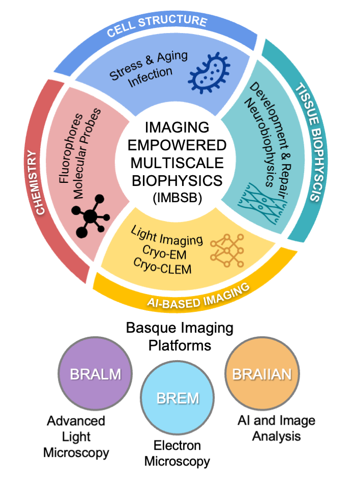
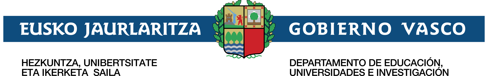

The **Imaging Empowered Multiscale Biophysics (IEMSB)** initiative has been officially funded under the **Ayudas para apoyar las actividades de grupos de investigación del sistema universitario vasco (2026-2029)** programme. The final resolution was communicated on **24 August 2026**.

Led by **Dr. Virginia Martinez-Martinez** and **Dr. Ignacio Arganda-Carreras**, IEMSB unites researchers from the University of the Basque Country (UPV/EHU) and the Spanish National Research Council (CSIC) at the Instituto Biofisika. The initiative connects molecular, cellular and tissue scales through advanced imaging, computation and quantitative biophysics.

<figure>
  
  <figcaption><b>Fig. 1:</b> IEMSB: Bridging scales through Imaging, Al, Chemistry and Biophysics. An initiative to foster scientific excellence, interdisciplinary training, and international impact.</figcaption>
</figure>

---

### 🔬 Scientific Goals

IEMSB is organised around four complementary research lines:

- **Structural Biology and Cellular Architecture**: resolving macromolecular structures and dynamics in native cellular environments using cryo-EM, cryo-ET and correlative fluorescence microscopy.
- **Tissue Biophysics**: understanding how cell-ECM interactions, forces and adhesion dynamics shape neural and epithelial tissues during development, repair and ageing.
- **AI-Based Tools for Imaging**: developing interpretable, scalable and data-efficient methods for denoising, segmentation, classification, particle picking and subtomogram analysis.
- **Chemistry-Driven Tools for Imaging**: designing fluorophores, fluorogenic probes and biosensors for quantitative and super-resolution imaging of molecular events in living systems.

The programme works in close coordination with the Basque imaging platforms **BRALM** (advanced light microscopy), **BREM** (electron microscopy) and **BRAIIAN** (AI and image analysis). Together, these platforms provide an integrated framework for imaging-driven multiscale biophysics.

---
### 🌐 Basque Imaging Platforms

- **BRALM**: advanced light and super-resolution microscopy.
- **BREM**: cryo-electron microscopy, cryo-electron tomography and correlative imaging.
- **BRAIIAN**: artificial intelligence, computer vision and image analysis.

---
### 👥 Project Team

#### Principal Investigators

- Dr. **Virginia Martinez-Martinez** (Permanent Doctor Researcher, UPV/EHU)
- Dr. **Ignacio Arganda-Carreras** (Ikerbasque Research Associate Professor, UPV/EHU; DIPC; Biofisika Institute)

#### CVPD Team

- Dr. **Fadi Dornaika** (Ikerbasque Research Professor, UPV/EHU)
- Dr. **Nagore Barrena** (Assistant Professor, UPV/EHU)  
- Dr. **Unai Elordi** (Assistant Professor, UPV/EHU)
- **Aitor González-Marfil** (PhD student, UPV/EHU; DIPC)

The wider IEMSB group comprises 22 members, including 21 doctors and one predoctoral researcher, with expertise spanning physical chemistry, biochemistry, molecular biology, computer science and artificial intelligence.

---
### 🕒 Timeline

- **Start date**: 1 January 2026
- **End date**: 31 December 2029
- **Duration**: 48 months

---
### 💰 Funding

- **Call**: [Ayudas para apoyar las actividades de grupos de investigación del sistema universitario vasco (2026-2029)](https://www.euskadi.eus/ayuda_subvencion/2026/ikertalde/web01-tramite/es/)
- **Funding body**: Gobierno Vasco / Euskal Jaurlaritza
- **Resolution**: 24 August 2026
- **Granted total**: **649,000 €**

---
### 📄 Project Documentation

- [Official programme and call information](https://www.euskadi.eus/ayuda_subvencion/2026/ikertalde/web01-tramite/es/)
- Final funding resolution communicated on **24 August 2026**

---
### 📬 Contacts

For project enquiries, please contact:
- [Dr. Ignacio Arganda-Carreras](mailto:ignacio.arganda@ehu.eus)
- [Dr. Virginia Martinez-Martinez](mailto:virgina.martinez@ehu.eus)
